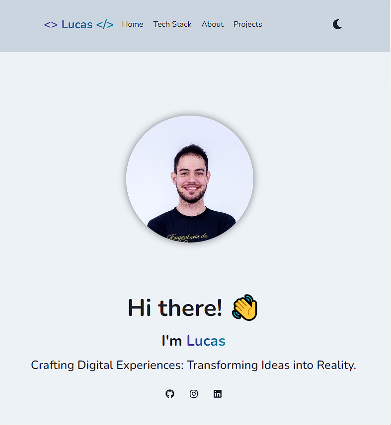

<h1 align="center">
  <br/>

  Lucas personal portfolio
</h1>

<p align="center">
  

  
  
  <a href="https://github.com/LucasPereiraMiranda/lucas-pereira-miranda.github.io/commits/main">
    
  </a>

  <a href="https://github.com/LucasPereiraMiranda/lucas-pereira-miranda.github.io/issues">
    
  </a>

  <a href="https://github.com/LucasPereiraMiranda/lucas-pereira-miranda.github.io/issues">
    
  </a>
</p>

<br>


## 🚀 Techs

Lucas Pereira Miranda portfolio was developed with these technologies

- [React](https://react.dev/)
- [Next](https://nextjs.org/)
- [Chakra UI](https://v2.chakra-ui.com/)
- [Framer Motion](https://www.framer.com/motion/)
- [React Scroll](https://www.npmjs.com/package/react-scroll)
- [Swiper](https://swiperjs.com/)

## 💻 Project

This website has been developed with the primary objective of being my personal portfolio, to be deployed and used to showcase some projects and practice web development.

## :boom: Installation

```bash
# clone this repo
$ git clone git@github.com:LucasPereiraMiranda/lucas-pereira-miranda.github.io.git

# use node 18 with .nvmrc reference
$ nvm use

# install dependencies
$ yarn install

# execute local
$ yarn dev

```

### Execution preview

Deployment link [here](https://lucas-pereira-miranda-github-io.vercel.app/)

#### Dark theme

<h1 align="center">
    
</h1>

#### Light theme

<h1 align="center">
    
</h1>

## License

[MIT](LICENSE)